# WirelessCharger-PCB-IE0408
Repositorio para el proyecto final del curso IE0408 sobre el diseño de una PCB de un cargador inalambrico. Contiene el circuito esquemático, el diseño de la PCB en *KiCad* y documentación sobre los componentes a utilizar, el procedimiento de diseño y otros detalles. 

Este repositorio y sus contenidos fueron diseñados durante el curso IE0408 durante el periodo II-2025 por los siguientes integrantes del equipo:

|        **Integrantes**      | **Carné** | **Correo electrónico**|
|:---------------------------:|:---------:|:---------------------:|
|    Anthony Calvo García     |   C11433  |  anthonycalvo50@gmail.com |
|   Rodrigo Madrigal Montes   |   C24458  | rmadrigalmontes@gmail.com |

## Agradecimientos a PCBWay  <!--  -->

El proyecto presentado fue posible gracias al valioso respaldo de **PCBWay**, a quienes deseamos extender nuestro más sincero agradecimiento. Las PCBs entregadas mostraron ser de una excelente calidad durante las pruebas realizadas, además de que el acabado en cada una de ellas es impecable, brindando exactamente el resultado que esperábamos.

Agradecemos, de igual manera, al equipo encargado de la atención al cliente, los cuales están siempre disponibles para brindar el apoyo solicitado de forma rápida y asertiva, lo que nos dio seguridad y tranquilidad durante todo el proceso de elaboración y entrega de las PCBs. 

### PCBs ensambladas 

Una vez recibidas las placas de PCBWay, se procedió con el ensamblaje manual de todos los componentes. A continuación se muestran imágenes del resultado:

| 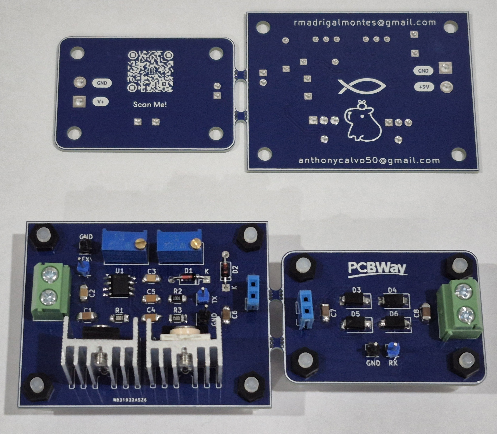 |
|:-----------------------------:|
|    *PCBs ensambladas y no ensambladas aún unidas*     |

| 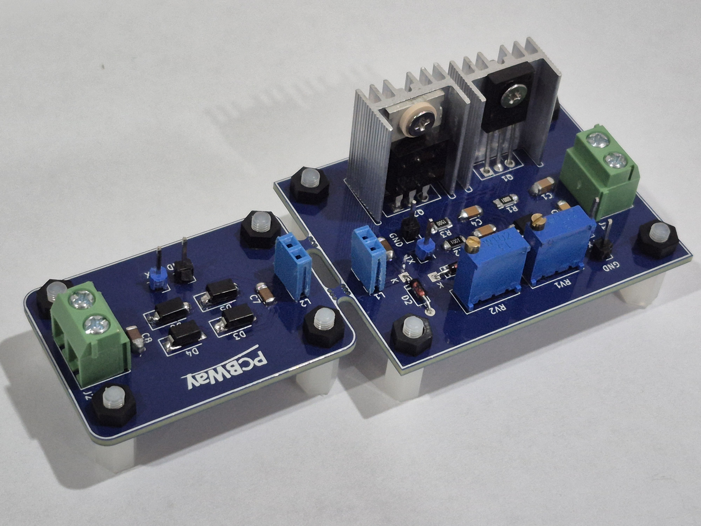 |
|:-----------------------------:|
|    *Vista lateral de las PCBs ensambladas unidas*     |

Una vez soldados todos los componentes en ambas PCBs se procedió a separarlas, rompiendo la uniones entre ambas como se muestra a continuación:

|  |
|:-----------------------------:|
|    *Separación de ambas PCBs*     |

Y una vez separadas, lijando el sobrante de la junta de unión en ambas PCBs y agregando las bobinas el resultado final es el siguiente:

| 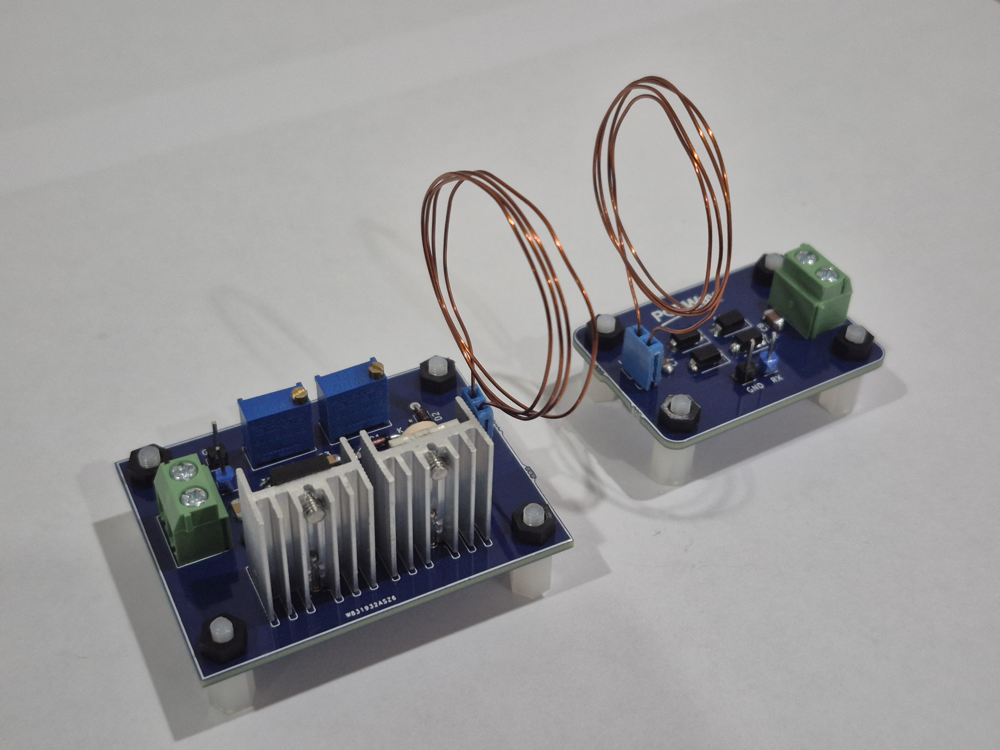 |
|:-----------------------------:|
|    *Ambas PCBs ensambladas y separadas*     |

Nuevamente extendemos nuestros agradecimientos a **PCBWay** por apoyar a la realización de este proyecto. Recomendamos sus servicios para estudiantes, profesionales y cualquier persona interesada en manufacturar PCBs de alta calidad. Más información en [pcbway.com](https://www.pcbway.com).

### Lista de componentes

A continuación se incluye una lista con los componentes utilizados en el diseño, con el mismo número que se les asignó en el diseño final de PCB:

| Componente | Valor / Modelo | Descripción / Función | Encapsulado |
|:---:|:---:|:---:|:---:|
| C1, C8 | 10uF, 2.2uF | Capacitor cerámico | (SMD) 1206 |
| C2, C3 | 100nF | Capacitor cerámico | (SMD) 1206 |
| C4, C5 | 10nF | Capacitor cerámico | (SMD) 1206 |
| C6, C7 | 2nF | Capacitor cerámico | (SMD) 1206 |
| D1, D2 | 1N4148 | Diodo Rectificador de alta velocidad | (THT) DO-35 |
| D3, D4, D5, D6 | SS14 | Diodo Schottky | (SMD) DO-214|
| J1, J2 | — | Terminal de tornillo (2 pines) | — | 
| L1, L2 | 1x02 (2.54mm) Female Header | Conectores para colocar las bobinas | — |
| Q1 | BD139 | Transistor NPN de potencia | (THT) TO-126 |
| Q2 | IRFZ44N | Transistor MOSFET de potencia | (THT) TO-220 |
| R1 | 100Ω | Resistor | (SMD) 1206 |
| R3 | 150Ω | Resistor | (SMD) 1206 |
| R2| 1kΩ | Resistor | (SMD) 1206 |
| RV1, RV2 | 1kΩ | Resistor variable/Potenciómetro, | (THT) 3296W |
| U1 | NE555D | Circuito Integrado Temporizador NE555 | (SMD) SOP8 |
| TP1, TP3, TP6 | 1x01 (2.54mm) Pin Header | Punto de prueba (Test Point) para Tierra (GND) | — |
| TP2 | 1x01 (2.54mm) Pin Header | Punto de prueba (Test Point) para medir la Salida del NE555 | — | 
| TP4 | 1x01 (2.54mm) Pin Header | Punto de prueba (Test Point) para medir la tensión del Receptor (RX) | — |
| TP5 | 1x01 (2.54mm) Pin Header | Punto de prueba (Test Point) para medir la tensión del Receptor (TX) | — | 

## Diseño de la PCB

Una vez simulado y definido el circuito final, se diseñó la PCB en *KiCad* con una arquitectura de **cuatro capas**, las cuales se distribuyen de la siguiente manera:

- **F.Cu**: Ruta de señales
- **In1.Cu**: Plano de alimentación +9V
- **In2.Cu**: Plano de tierra (GND)
- **B.Cu**: Ruta de señales

### Capas de la PCB

| 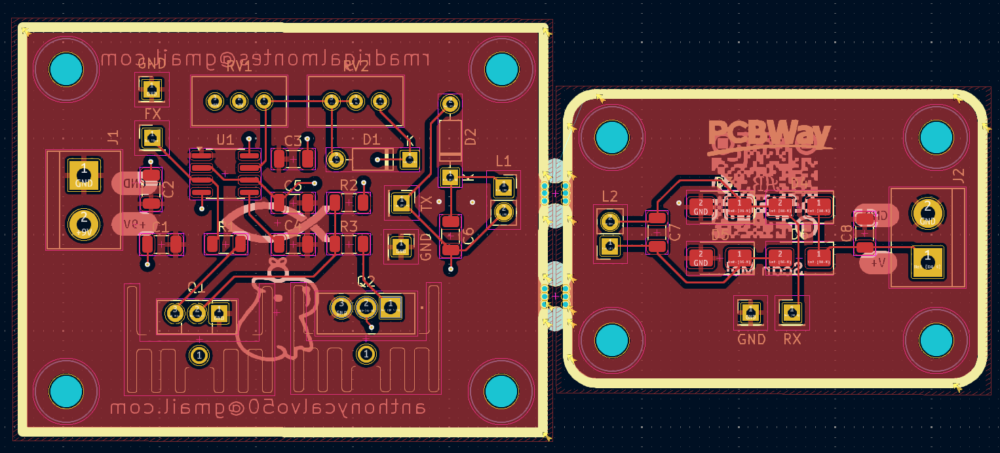 |
|:-----------------------------:|
|    *Capa superior (F.Cu)*     |

| 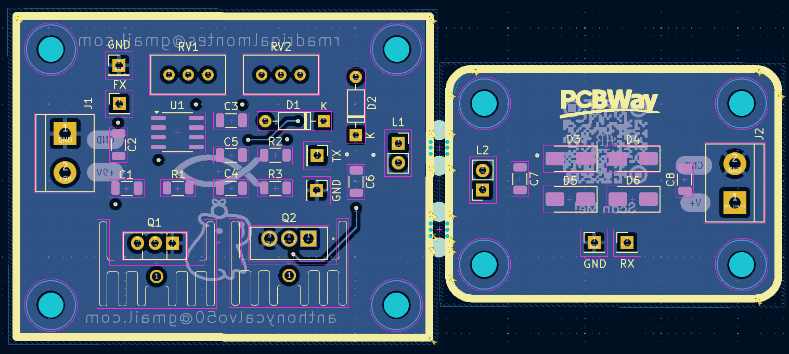 |
|:-----------------------------:|
|    *Capa inferior (B.Cu)*     |

| 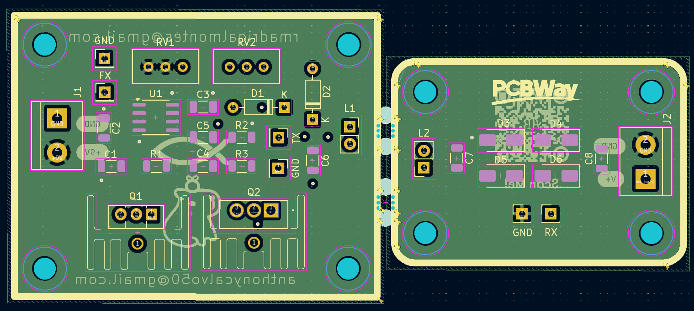 |
|:-------------------------------------------:|
|      *Capa interna 1 (In1.Cu)- +9V*         |

| 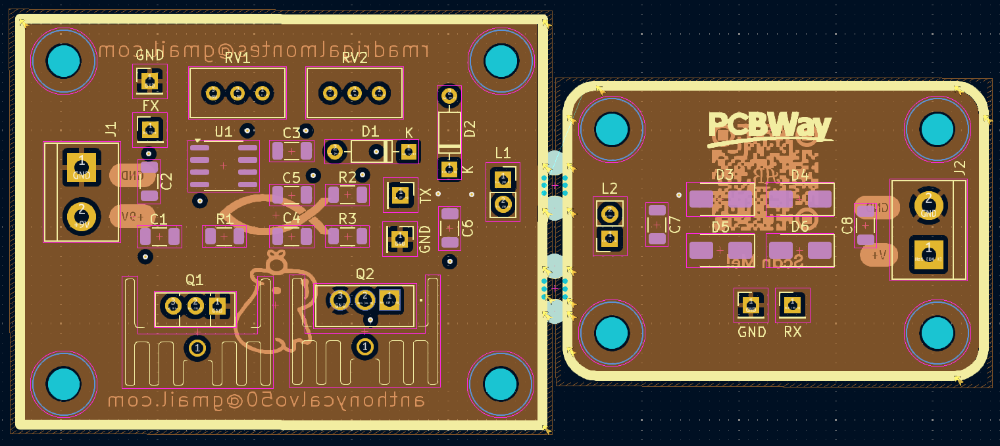 |
|:-------------------------------------:|
|        *Capa interna (In2.Cu) - GND*         |

Además, se agregaron zonas de serigrafía, agujeros de montaje, así como textos identificativos y logotipos en el *silkscreen* con el nombre del proyecto y los autores. Como resultado final se muestra la PCB en el visor 3D de *KiCad* con y sin los modelos 3D 

| 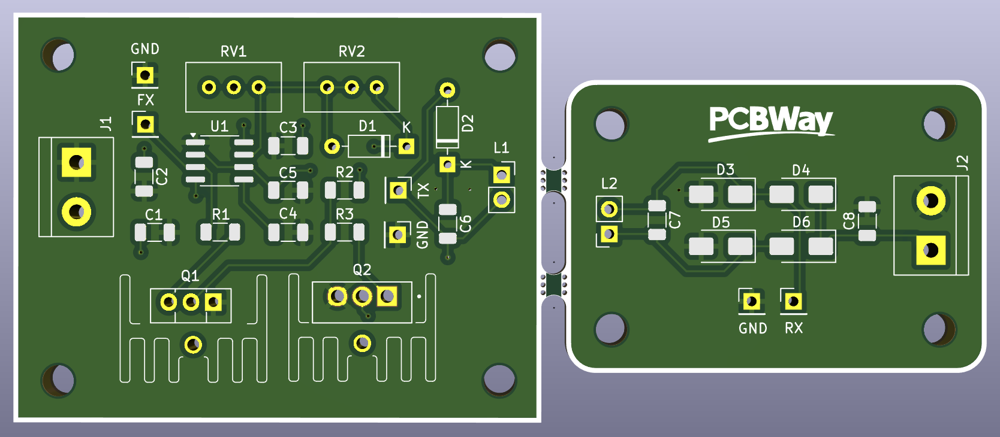 |
|:--:|
| *Vista 3D Frontal de la PCB en KiCad* |

| 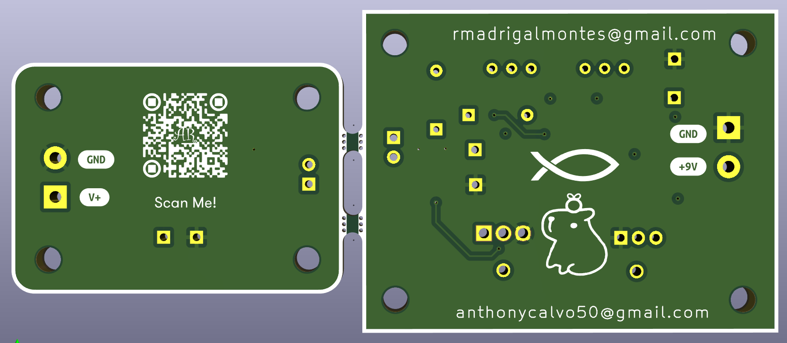 |
|:--:|
| *Vista 3D Frontal de la PCB en KiCad* |

| 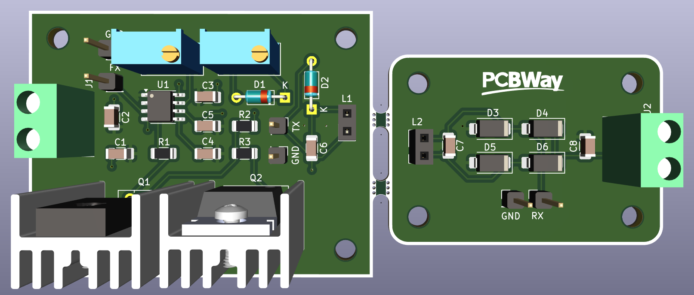 |
|:--:|
| *Vista 3D Frontal de la PCB en KiCad con modelos 3D* |

| 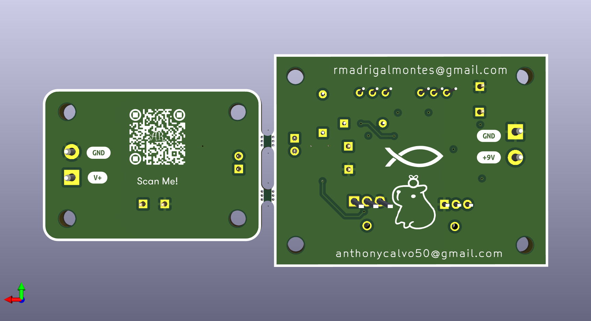 |
|:--:|
| *Vista 3D Trasera de la PCB en KiCad con modelos 3D* |

| 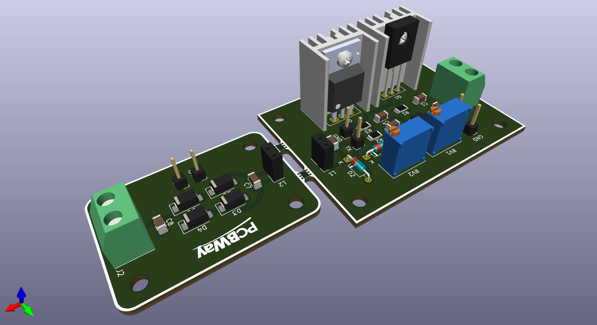 |
|:--:|
| *Vista 3D Lateral Izquierda de la PCB en KiCad con modelos 3D* |

